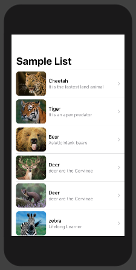

# SwiftUI-Demo
SwiftUI &amp; Simple UI Testing tutorial


### SwiftUI 
> Sample code for below 
  1. Button
  2. Label
  3. TextField
  4. Slider
  5. List(Table)
  6. Map
  7. Picker


> Screenshots

  |    |  


> Screenshots

 
 
 
 

 


#### Swift code　

> Gradient Color

```javascript
.background(LinearGradient(gradient: Gradient(colors: [Color.blue, Color.green]), startPoint: .leading, endPoint: .trailing))
```
> Stoke Layer

```javascript
.stroke(LinearGradient(gradient: Gradient(colors: [Color.yellow, Color.orange]), startPoint: .leading, endPoint: .trailing), lineWidth: 4)
```
> Shadow

```javascript
            .shadow(color: .gray, radius: 20.0, x: 20, y: 10)
```
# Or
```javascript
            .shadow(radius: 5.0)
```
> NavigationView

```javascript

  @State private var fullScreen = false

    var body: some View {
        NavigationView {
            Button("Toggle Full Screen") {
                self.fullScreen.toggle()
            }
            .navigationBarTitle("Full Screen")
            .navigationBarHidden(fullScreen)
        }
        .statusBar(hidden: fullScreen)
    }
    ```
